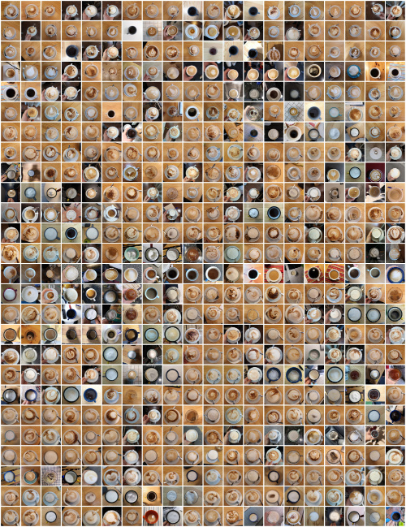
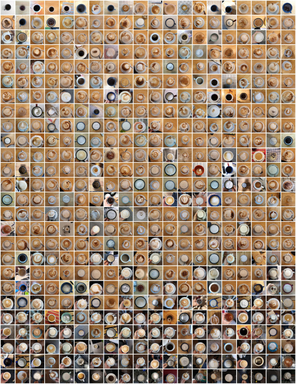

# coffeescript.py

Since begining 2019 I take a picture of every coffee I drink. `coffeescript.py` is a small script which takes these pictures, crops them and creates a compilation out of it.

This compilation looks for 11th February to 11th August 2019 like this (sorted by date and time):



In addition, the compilation can also be sorted by brightness of the cropped picture:



At the moment, the cropping and processing of the pictures is tightly coupled towards the images I get out of my smartphone. The coffee should be in the centre of the image, as this area will be chosen for cropping. Besides this constraint, several parameters can be adjusted by passing in command line arguments.

The script uses [Pillow](https://pillow.readthedocs.io/en/stable/) for reading, analysing and writing images.

## Setup

```bash
# create a virtual env if needed
python3 -m venv .venv
source .venv/bin/activate

# install dependencies
pip install -r requirements.txt
python ./coffeescript.py
```
